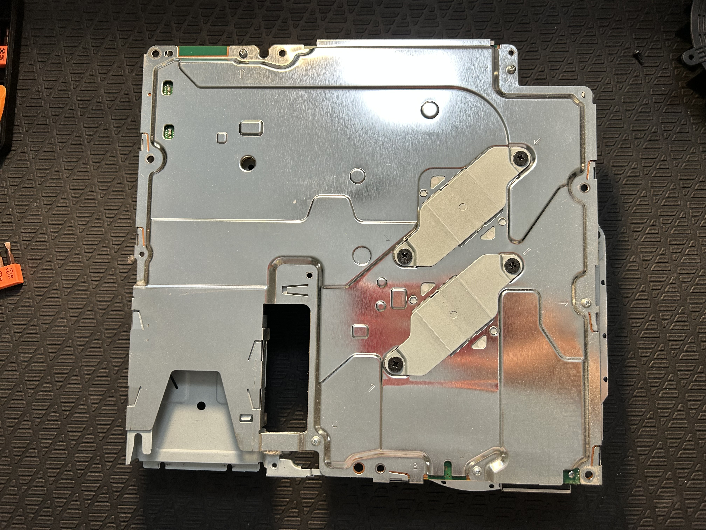
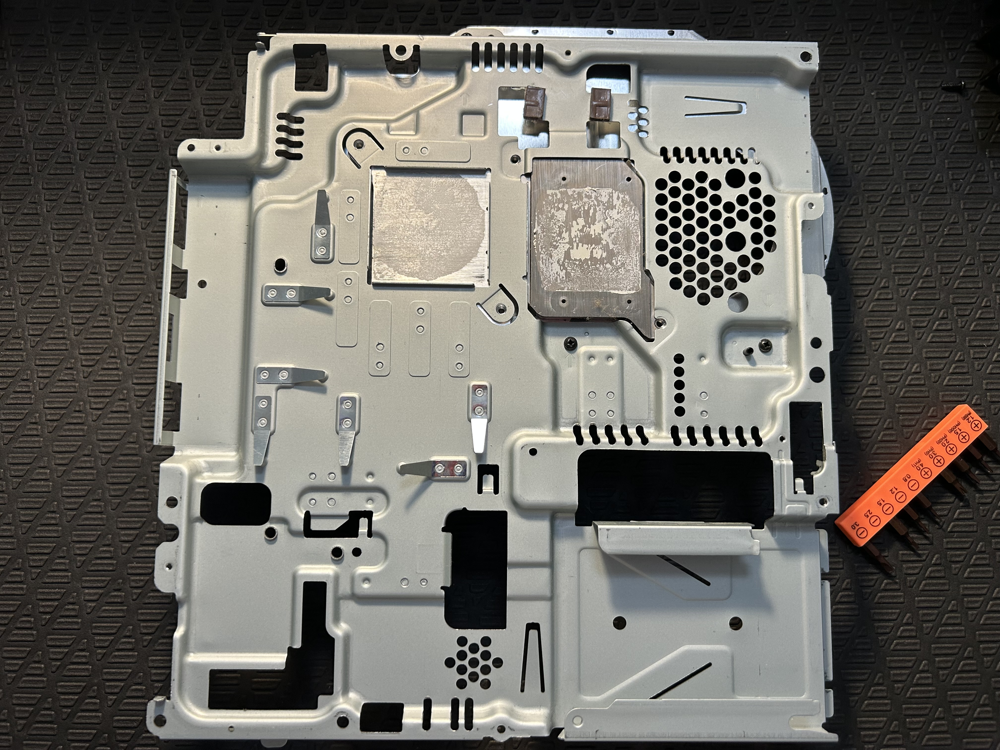

# Playstation 3 (PS3) Slim Refurbishment
Below is an overview of my PS3 Slim Refurbishing Process

   
    
   Figure 1: PS3 Slim with Materials for Refurbishment

## Materials List
#### Tools:
* 1x Torx TR8 Security Screwdriver
* 1x Phillips #1 Screwdriver
* 1x Phillips #0 Screwdriver
* 1x Pair of Tweezers (Curved or Straight)

#### Cleaning Equipment:
* 1x Medium-Sized Cleaning Cloth
* Paper Towels
* Q-Tips (As-Needed)
* 1x Small ESD Bush
* 91% Isopropyl Alcohol
* Dish Soap
* Distilled Water
* Handheld Vacuum or Vacuum with hand attachment
#### Miscellaneous:
* 1x Tube of Thermal Compound
  * e.g. Arctic MX-7
* 1x CR2032 Lithium Battery (optional)
* 2.0mm Thermal Pads (optional)
  * 6W/mK pads are readily available.

 

## Refurbishment Process
#### 1. Removing Screws from Base Enclosure
There are 9 screws that must be removed to take off the top PS3 cover and remove the HDD.
* 5 Phillips #0 Screws
* 4 Torx #8 Security Screws

   
   
   Figure 2: Screw Locations for Base Enclosure Removal

#### 2. SATA HDD Removal
You may

   
   
   Figure 3: Visual for Removing the SATA HDD Bracket

 

#### 3. Optional SATA HDD/SSD Upgrade
You can remove the HDD from the HDD bracket to clean and upgrade the drive, if necessary.

   
   
   Figure 4: Screw Locations for SATA SSD/HDD Removal

 

> _While the PS3 relies on SATA I speeds, the PS3 can still benefit from an updated 2.5" HDD or SSD. An SSD upgrade eliminates HDD drive spin noise and can result in faster loading times and reduced heating._

 

#### 4. PS3 Top Enclosure Removed
After removing the top PS3 enclosure, the power supply, blu-ray drive, and push-button plate can be removed.

   
   
   Figure 5: Visual of PS3 components needed to be removed

 

#### 5. PS3 Slim after removing various Components
After removing the components in part 4, the PS3 fan and metal motherboard shielding can be removed from the base enclosure.

   
   
   Figure 6: PS3 Slim after removing various components

 

#### 6. Removing the Motherboard Shielding
There are 9 screws that must be removed to remove the motherboard shielding:
* 5 Phillips #0 Screws
* 4 Phillips #1 Screws

   
   
   Figure 7: Screw Locations for the Motherboard Shielding

 

#### 7. Removing Old Thermal Compound
The thermal paste for this PS3 is over 15 years old and may benefit greatly upon replacement. The old thermal compound can be removed with a paper towel damped with 91% isopropyl alcohol.

   
   
   Figure 8: Residual Thermal Compound on the Motherboard Shielding

    

   
   
   Figure 9: Old Thermal Compound on the Cell Processor and Reality Synthesizer (RSX)

 

#### 8. Replacing Thermal Compound and CR2032 Lithium Battery
The CR2032 Lithium Battery inside the PS3 is over 15 years old, and may need replacement. The CR2032 battery voltage read ~2.9V on my multimeter, which, indicated the need for a replacement as fresh CR2032 lithium batteries have a terminal voltage of ~3.2V or ~3.3V when new.

   
   
   Figure 7: Screw Locations for the Motherboard Shielding

 

> _To ensure complete coverage of the Cell Processor and Reality Synthesizer (RSX), a generous application of thermal compound is generally preferred over a minimal amount._

 

## Summary
&emsp; Refurbishing this PS3 Slim has strengthened my confidence working with electronics. The PS3 slim was clearly designed as a modular system, and I can now better appreciate the benefits of modular electronics for repairability after refubishing this console.
